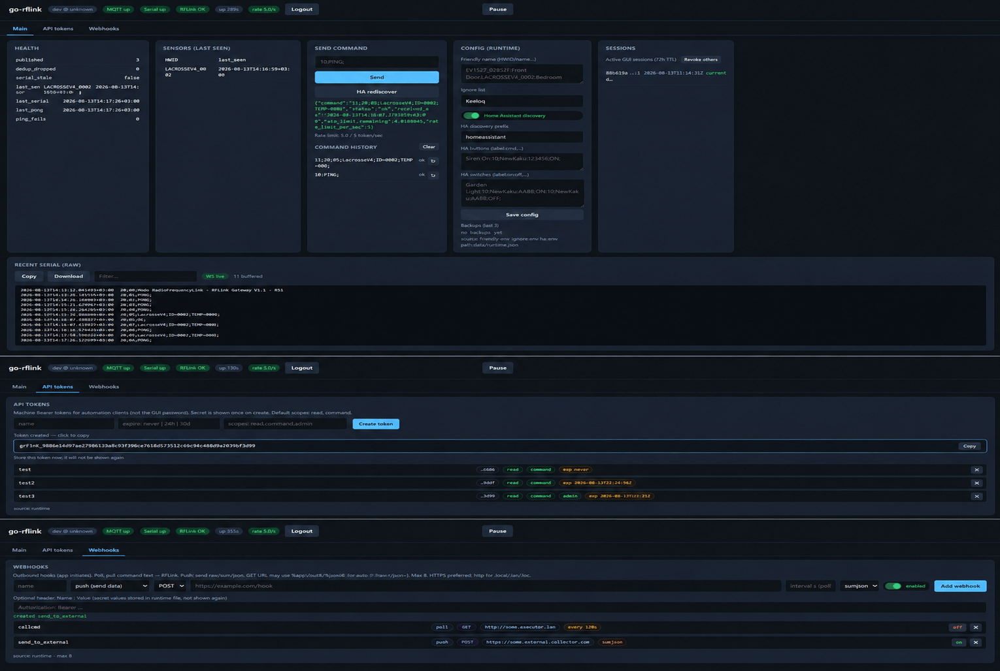

[](https://github.com/MERKAT0R/go-RFLink/actions/workflows/goRFLink.yml)
[](https://scorecard.dev/viewer/?uri=github.com/MERKAT0R/go-RFLink)
[](https://github.com/MERKAT0R/go-RFLink)
[](https://github.com/MERKAT0R/go-RFLink/actions/workflows/goRFLink.yml)
[](https://pkg.go.dev/github.com/MERKAT0R/go-RFLink/rflink)
[](https://github.com/MERKAT0R/go-RFLink/pkgs/container/go-rflink)
[](https://github.com/MERKAT0R/go-RFLink/releases)

[-111111?logo=x&logoColor=white)](https://x.ai)

# go-rflink

Bridge [RFLink](https://www.rflink.nl/) Gateway serial traffic to MQTT (MQTT 5 via [paho.golang/autopaho](https://github.com/eclipse-paho/paho.golang)).

Per-sensor topics keyed by **HWID** (`MODEL_ID`), optional Home Assistant discovery, command bridge with whitelist/rate-limit, health metrics, serial PING watchdog and debounce.

App design allows you to run it in only ENV mode, but **it’s best with GUI** for fullness & simple experience + functionality

Optional **HTTP API + embedded Web GUI** for local control without MQTT, plus **outbound webhooks** (poll/push).



<!-- Place a real capture at screenshots/gui.png (e.g. Main tab with health + raw). -->

## Features

- MQTT 5 client with auto-reconnect
- Sensor topics by HWID; optional `PUBLISH_HWID_MAP` for stable canonical IDs
- Field topics + `sumJson` (includes `received_at`, `timestamp`, optional friendly name)
- Temperature units: `C` (default), `F`, or `RAW`
- Multi-button remotes: `SWITCH`+`CMD` → separate `sw_XX` binary channels
- Debounce: drops radio retransmits within `PUBLISH_DEDUP_WINDOW_MS` (ignores RFLink sequence)
- Pending latest-state buffer while MQTT is down (no `cmd`/`switch` replay)
- MQTT → RFLink commands with normalize, whitelist, rate-limit, `cmd/result` ack
- Home Assistant discovery: sensors, battery, per-button binary_sensors, optional custom buttons/switches
- Status topics: app, serial, health, gateway info
- RFLink `10;PING;` keepalive + unresponsive detection
- Ignore-list for noisy models/IDs (e.g. `Keeloq`)
- TLS (CA file / insecure skip with warning)
- Graceful shutdown (`SIGINT` / `SIGTERM`, Windows + Linux)
- **HTTP API** — health/sensors/raw/command/config/HA rediscover; Docker/K8s probes
- **Web GUI** — status, live raw (WebSocket), commands, config, sessions, API tokens, webhooks
- **Runtime overlay** (`data/runtime.json`) — GUI/API edits with env merge, backups, hot-reload
- **Webhooks** — poll (pull command) / push (raw or sumJson); GET URL placeholders
- Session auth for GUI; scoped API Bearer tokens; CSRF; rate-limited login

## MQTT topic layout

Base topic default: `rflink`.

| Topic | Direction | Description |
|-------|-----------|-------------|
| `rflink/{HWID}/temp` | pub | Temperature |
| `rflink/{HWID}/hum` | pub | Humidity |
| `rflink/{HWID}/bat` | pub | Battery (`OK` / `LOW`) |
| `rflink/{HWID}/sw_{N}` | pub | Button/channel `N` state (`ON`/`OFF`) |
| `rflink/{HWID}/sumJson` | pub | Full sensor JSON |
| `rflink/send` | sub | Commands to RFLink (override with `PUBLISH_CMD_TOPIC`) |
| `rflink/cmd/result` | pub | Command outcome (`ok`, `rejected`, `rate_limited`, …) |
| `rflink/status` | pub | Process/MQTT availability (`online`/`offline`) |
| `rflink/serial/status` | pub | Serial port availability |
| `rflink/health` | pub | Metrics JSON |
| `rflink/gateway/info` | pub | Version / PONG |
| `rflink/admin/rediscover` | sub | Clear HA discovery cache (when HA discovery enabled) |

### sumJson example

```json
{
  "hwid": "EV1527_0B25F2",
  "model": "EV1527",
  "id": "0b25f2",
  "name": "goRFLink_EV1527 0b25f2",
  "switch": "04",
  "cmd": "ON",
  "timestamp": "2026-08-08T15:33:14.138+03:00",
  "received_at": "2026-08-08T15:33:14.138+03:00"
}
```

## Quick best start

```bash
# optional: source env.sh.example after editing
export PUBLISH_HOST="mqtt.ip.address:1883"
export PUBLISH_SCHEME="mqtt"
export PUBLISH_MQTT_USERNAME="gorflink"
export PUBLISH_MQTT_PASSWORD="super-strong-mqtt-password"
export PUBLISH_HOME_ASSISTANT_DISCOVERY=true
export SERIAL_DEVICE=/dev/ttyACM0      # for ex. /dev/serial/by-id/usb-Prolific_Technology_Inc._USB-Serial_Controller_D-if00-port0 or COM4
export HTTP_LISTEN=127.0.0.1:8080
export HTTP_AUTH_TOKEN='use-a-long-random-secret-16+'

go run .
```

Prefer not to build from source? Pull a ready image instead:

```bash
docker pull ghcr.io/merkat0r/go-rflink:latest
```

See [Docker](#docker) for full `docker run` / Compose examples.

### Commands to RFLink

```bash
mosquitto_pub -t rflink/send -m "10;NewKaku;123456;1;OFF;"
# result on rflink/cmd/result
```

Commands are trimmed, `;` is appended if missing, RFLink format is checked ([protocol reference](https://rflink.nl/protref.php)), optional prefix whitelist and rate-limit applied.

Valid examples: `10;PING;`, `10;NewKaku;0cac142;3;ON;`, `11;20;01;LacrosseV4;ID=0002;TEMP=00cd;` (echo/resend).

### Home Assistant

```bash
export PUBLISH_HOME_ASSISTANT_DISCOVERY=true
export PUBLISH_FRIENDLY_NAMES="EV1527_0B25F2:Front Door Remote"
export PUBLISH_HA_BUTTONS="Siren:10;NewKaku;123456;ON;"
export PUBLISH_HA_SWITCHES="Garden:10;NewKaku;AABB;ON;:10;NewKaku;AABB;OFF;"
```

- Device name defaults to `goRFLink_{MODEL} {ID}` if no friendly name is set
- Entity names are short (`Temperature`, `Button 04`) to avoid doubled HA entity_ids
- Rediscover: `mosquitto_pub -t rflink/admin/rediscover -m 1` (or HTTP `POST /api/v1/ha/rediscover`)

### TLS

```bash
export PUBLISH_SCHEME=ssl
export PUBLISH_HOST=mqtt.example.com:8883
export PUBLISH_TLS_CA_FILE=/path/to/ca.crt
```

### HTTP API & Web GUI

```bash
export HTTP_LISTEN=127.0.0.1:8080
export HTTP_AUTH_TOKEN='use-a-long-random-secret'
```

Then open `http://127.0.0.1:8080/` and log in.

**Full HTTP documentation:** [`HTTP.md`](HTTP.md) — auth model, scopes, routes, runtime overlay, sessions, webhooks, security notes.

<details>
<summary>HTTP quick reference (spoiler)</summary>

| Item | Detail |
|------|--------|
| Probes | `GET /healthz`, `GET /readyz` (no auth) |
| Health / sensors / raw | `GET /api/v1/health`, `/sensors`, `/rflink/raw` |
| Command | `POST /api/v1/command` — same validation as MQTT |
| Live raw | WebSocket `/api/v1/rflink/raw/ws` |
| GUI auth | `HTTP_AUTH_TOKEN` → session cookie (72h); no token → GUI locked |
| API auth | `API_AUTH_TOKEN` or GUI-created tokens; scopes `read` / `command` / `admin` |
| Config overlay | `RUNTIME_CONFIG_FILE` (default `data/runtime.json`); present keys override env |
| Webhooks | Poll (pull cmd) or push (`raw` / `sumjson`); GET supports `%payload%` in URL |
| Bind | Prefer `127.0.0.1`; non-loopback without credentials logs a warning |

</details>

### Docker

**Pre-built image** (no local build required):

```bash
docker pull ghcr.io/merkat0r/go-rflink:latest
# optional pinned release:
# docker pull ghcr.io/merkat0r/go-rflink:v1.x.y
```

Run from GHCR:

```bash
# named volume keeps runtime.json / backups across restarts
docker volume create go-rflink-data

docker run --name go-rflink --restart unless-stopped \
  --device=/dev/ttyACM0 \
  -e SERIAL_DEVICE=/dev/ttyACM0 \
  -e PUBLISH_HOST=192.168.0.1:1883 \
  -e PUBLISH_MQTT_USERNAME=gorflink \
  -e PUBLISH_MQTT_PASSWORD='super-strong-mqtt-password' \
  -e PUBLISH_HOME_ASSISTANT_DISCOVERY=true \
  -e HTTP_LISTEN=0.0.0.0:8080 \
  -e HTTP_AUTH_TOKEN='use-a-long-random-secret-16+' \
  -e RUNTIME_CONFIG_FILE=/app/data/runtime.json \
  -p 127.0.0.1:8080:8080 \
  -v go-rflink-data:/app/data \
  ghcr.io/merkat0r/go-rflink:latest
```

> Bind the host port to `127.0.0.1` when exposing the GUI; set a strong `HTTP_AUTH_TOKEN`. The named volume `go-rflink-data` stores `runtime.json` and backups.

**Minimal Compose** (same stack, no local build):

```yaml
# docker-compose.ghcr.yml — example only
services:
  go-rflink:
    image: ghcr.io/merkat0r/go-rflink:latest
    container_name: go-rflink
    restart: unless-stopped
    devices:
      - /dev/ttyACM0:/dev/ttyACM0   # for ex. /dev/serial/by-id/usb-Prolific_Technology_Inc._USB-Serial_Controller_D-if00-port0:/dev/ttyACM0
    ports:
      - "127.0.0.1:8080:8080"
    volumes:
      - go-rflink-data:/app/data
    environment:
      SERIAL_DEVICE: /dev/ttyACM0
      PUBLISH_HOST: 192.168.0.1:1883
      PUBLISH_MQTT_USERNAME: gorflink
      PUBLISH_MQTT_PASSWORD: super-strong-mqtt-password
      PUBLISH_HOME_ASSISTANT_DISCOVERY: "true"
      HTTP_LISTEN: "0.0.0.0:8080"
      HTTP_AUTH_TOKEN: use-a-long-random-secret-16+
      RUNTIME_CONFIG_FILE: /app/data/runtime.json
    healthcheck:                   # optional: HEALTHCHECK when HTTP is enabled (override if Listen differs)
      test: ["CMD", "wget", "-qO-", "http://127.0.0.1:8080/healthz"]
      interval: 30s
      timeout: 5s
      retries: 3
      start_period: 15s
volumes:
  go-rflink-data:
```

```bash
docker compose -f docker-compose.ghcr.yml up -d
```

**Build locally** (optional) — multi-stage image from [`Dockerfile`](Dockerfile) (Go builder → alpine runtime, embeds `VERSION` / `GIT_SHA`):

```bash
docker build \
  --build-arg VERSION=dev \
  --build-arg GIT_SHA="$(git rev-parse --short HEAD 2>/dev/null || echo unknown)" \
  -t go-rflink:local \
  -f Dockerfile \
  .

docker volume create go-rflink-data

docker run --name go-rflink --restart unless-stopped \
  --device=/dev/ttyACM0 \
  -e SERIAL_DEVICE=/dev/ttyACM0 \
  -e PUBLISH_HOST=192.168.0.1:1883 \
  -e HTTP_LISTEN=0.0.0.0:8080 \
  -e HTTP_AUTH_TOKEN='change-me-to-a-long-secret' \
  -e RUNTIME_CONFIG_FILE=/app/data/runtime.json \
  -p 127.0.0.1:8080:8080 \
  -v go-rflink-data:/app/data \
  go-rflink:local
```

### Docker Compose (full)

Repo [`docker-compose.yml`](docker-compose.yml) includes optional Mosquitto, HTTP env, data volume, and healthcheck. Serial path is configurable.

```bash
cp env.sh.example .env   # edit SERIAL_DEVICE / PUBLISH_* / HTTP_* as needed

# pre-built image (no build):
IMAGE=ghcr.io/merkat0r/go-rflink:latest SERIAL_DEVICE=/dev/ttyACM0 docker compose up -d

# or build from source:
# SERIAL_DEVICE=/dev/ttyACM0 docker compose up -d --build

docker compose logs -f go-rflink
```

Also see [`deploy/mosquitto/mosquitto.conf`](deploy/mosquitto/mosquitto.conf).

## Configuration

Full sample: [`env.sh.example`](env.sh.example). Only override what you need.

### Global

| Variable | Default | Description |
|----------|---------|-------------|
| `LOG_LEVEL` | `info` | `debug`, `info`, `warn`, `error` |
| `GORFLINK_DEBUG` | `false` | Force debug log level for tests |

### MQTT publish

| Variable | Default | Description |
|----------|---------|-------------|
| `PUBLISH_HOST` | `localhost:1883` | Broker host:port |
| `PUBLISH_SCHEME` | `tcp` | `tcp`/`mqtt`, `ssl`/`tls`/`mqtts`, `ws`, `wss` |
| `PUBLISH_MQTT_USERNAME` | `username` | MQTT username |
| `PUBLISH_MQTT_PASSWORD` | `password` | MQTT password |
| `PUBLISH_CLIENT_ID` | `gorflink` | MQTT client id |
| `PUBLISH_TOPIC` | `rflink` | Base topic |
| `PUBLISH_CMD_TOPIC` | `{topic}/send` | Command subscribe topic |
| `PUBLISH_QOS` | `0` | QoS 0–2 |
| `PUBLISH_RETAIN` | `false` | Default retain (event fields force false) |
| `PUBLISH_CLEAN_SESSION` | `true` | Clean start on first connect |
| `PUBLISH_KEEPALIVE` | `30` | Keepalive seconds |
| `PUBLISH_SESSION_EXPIRY` | `0` | MQTT 5 session expiry seconds |
| `PUBLISH_INFINITY_RECONNECT` | `true` | Background reconnect |
| `PUBLISH_CONNECT_RETRY_INTERVAL` | `5` | Reconnect backoff base (seconds) |
| `PUBLISH_TLS_CA_FILE` | | CA certificate path |
| `PUBLISH_TLS_INSECURE_SKIP_VERIFY` | `false` | Skip TLS verify (warned) |
| `PUBLISH_LWT_*` | | Optional custom LWT (default: `{topic}/status` offline) |
| `PUBLISH_TEMPERATURE_UNIT` | `C` | `C`, `F`, or `RAW` |
| `PUBLISH_FRIENDLY_NAMES` | | `HWID:Name,HWID2:Name2` |
| `PUBLISH_HWID_MAP` | | `ID:CanonicalHWID,...` |
| `PUBLISH_IGNORE_LIST` | `Keeloq` | Comma-separated model/HWID/ID to drop |
| `PUBLISH_DEDUP_WINDOW_MS` | `3000` | Debounce window (`0` = off) |
| `PUBLISH_PENDING_TTL_SEC` | `60` | Latest-state buffer while MQTT down |
| `PUBLISH_HEALTH_LOG_INTERVAL_SEC` | `300` | Health log/publish interval (`0` = off) |
| `PUBLISH_COMMAND_WHITELIST` | | Allowed prefixes, e.g. `10;,11;` (empty = all) |
| `PUBLISH_COMMAND_RATE_LIMIT` | `5` | Max commands/sec to serial (`0` = unlimited) |
| `PUBLISH_COMMAND_MAX_LEN` | `256` | Max normalized command length |
| `PUBLISH_HOME_ASSISTANT_DISCOVERY` | `false` | Enable HA discovery |
| `PUBLISH_HA_DISCOVERY_PREFIX` | `homeassistant` | HA discovery prefix |
| `PUBLISH_HA_BUTTONS` | | `Label:10;cmd;,Label2:10;cmd2;` |
| `PUBLISH_HA_SWITCHES` | | `Label:on_cmd:off_cmd,...` |

### Serial

| Variable | Default | Description |
|----------|---------|-------------|
| `SERIAL_DEVICE` | `/dev/ttyUSB0` | Serial device path |
| `SERIAL_BAUD` | `57600` | Baud rate |
| `SERIAL_READ_TIMEOUT_SEC` | `10` | Read timeout |
| `SERIAL_RECONNECT_MIN_DELAY_SEC` | `3` | Min reconnect delay |
| `SERIAL_RECONNECT_MAX_DELAY_SEC` | `60` | Max reconnect delay |
| `SERIAL_WATCHDOG_SEC` | `120` | Warn if no serial data (`0` = off) |
| `SERIAL_PING_INTERVAL_SEC` | `60` | `10;PING;` interval (`0` = off) |
| `SERIAL_PING_TIMEOUT_SEC` | `5` | PONG wait timeout |
| `SERIAL_PING_FAIL_THRESHOLD` | `3` | Failures before `rflink_unresponsive` |

### HTTP / runtime / webhooks

| Variable | Default | Description |
|----------|---------|-------------|
| `HTTP_LISTEN` | _(empty)_ | e.g. `127.0.0.1:8080`; empty disables HTTP |
| `HTTP_AUTH_TOKEN` | | GUI password (≥16 chars recommended) |
| `HTTP_GUI` | `true` | Embedded UI at `/` |
| `HTTP_READ_ONLY` | `false` | Reject mutations |
| `HTTP_CORS_ORIGINS` | | Allowed Origins (empty = CORS off) |
| `HTTP_TRUSTED_PROXIES` | | CIDRs trusted for forwarded client IP |
| `HTTP_RAW_BUFFER_SIZE` | `100` | Recent serial lines for API/GUI |
| `HTTP_SENSOR_BUFFER_SIZE` | `50` | Recent sensor samples |
| `RUNTIME_CONFIG_FILE` | `data/runtime.json` | GUI/API config overlay |
| `API_AUTH_TOKEN` | | `name:TOKEN[:expire[:scopes]],…` |
| `API_TOKEN_PEPPER` | | Optional pepper for token hashes |
| `WEBHOOKS_JSON` | | JSON array of outbound webhooks |

See [`HTTP.md`](HTTP.md) for auth, scopes, routes, and webhook URL placeholders.

## Health payload (excerpt)

```json
{
  "version": "1.2.3",
  "git_sha": "abc1234",
  "started_at": "2026-08-08T12:00:00Z",
  "status": "online",
  "mqtt_connected": true,
  "serial_connected": true,
  "serial_stale": false,
  "rflink_unresponsive": false,
  "last_pong_at": "2026-08-08T12:05:00Z",
  "sensors_last_seen": { "EV1527_0B25F2": "2026-08-08T12:04:59Z" },
  "dedup_dropped": 3,
  "published": 120
}
```

Also available via `GET /api/v1/health` when HTTP is enabled.

## Roadmap / TODO

Ideas for further development (not scheduled; PRs welcome).

### High value

- [x] **HTTP API** — local control without MQTT only
- [x] **Web GUI** — optional lightweight status UI (embedded)
- [x] **HTTP API auth** — GUI sessions + scoped API tokens
- [x] **Config overlay** — runtime.json + env merge, hot-reload, backups
- [x] **Webhooks** — poll / push outbound hooks
- [ ] **Per-sensor throttle** — min publish interval per HWID for chatty devices
- [ ] **RTC Devices Card** — easy card (only GUI) with menu for pairing Rolling-Time-Codes devices
- [ ] **Prometheus metrics** — `/metrics` (published, dropped, ping fails, connected gauges)

### Home Assistant / devices

- [ ] **Device triggers / events** for momentary RF buttons (alongside `off_delay` binary_sensors)
- [ ] **HA switch state feedback** when RFLink echoes RX after TX
- [ ] **Per-sensor availability** based on last-seen, not only global serial status
- [ ] **Rediscover + purge** helper docs/script for stale HA entities
- [ ] **HA App** template for direct run on HA
### Reliability & serial

- [ ] **NET RFLink Devices** / support RFLink Devices that runs over network (ESP32 versions)
- [ ] **Multiple serial ports** / multiple RFLink gateways in one process (maybe someday — not priority)

### Security & ops

- [ ] **mTLS client certificates** for MQTT
- [ ] **Structured audit log** of commands (who/when/result) beyond current session/token logs

### Nice to have

- [x] **Hot-reload** of ignore list / friendly names / related runtime keys
- [ ] **Env file** (.env) optional .env loader if present for simplicity 
- [x] **OpenSSF Scorecard** badge / workflow
- [ ] **UnRaid** App template for unraid store
- [ ] **Publish internal coverage + integration tests** (fake serial + mock MQTT)
## License

AGPL-3.0-or-later
